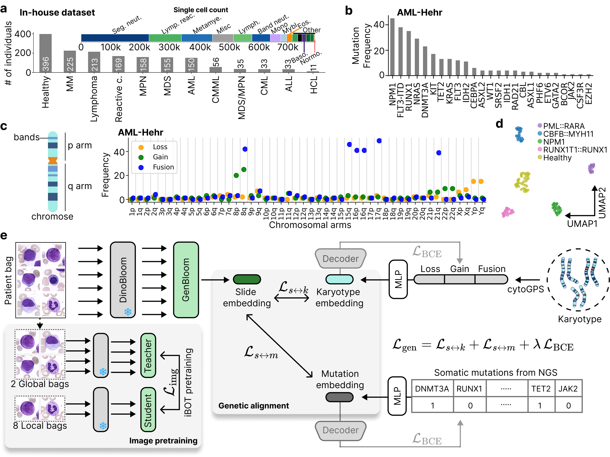
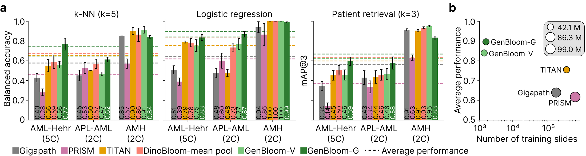

# GenBloom

## Genetically Aligned Patient Representations Improve Hematological Diagnosis
*29th INTERNATIONAL CONFERENCE ON MEDICAL IMAGE COMPUTING AND COMPUTER ASSISTED INTERVENTION (MICCAI 2026)*

[Paper link](https://doi.org/10.48550/arXiv.2605.29980) | [Download Model](https://huggingface.co/MarrLab/GenBloom) | [Cite](#reference)


**Abstract:** Multimodal alignment of histopathology encoders with transcriptomic and genomic data has been shown to significantly improve performance in downstream diagnostic tasks. Hematological cytology is unique in that visual single-cell evaluation is often paired with cytogenetics and molecular genetics for blood cancer diagnosis. In this study, we present a framework to align single white blood cell images with chromosomal aberrations (karyotype) and somatic mutations from targeted gene panels. Our training strategy follows a two-stage approach: (i) self-supervised, vision-only pretraining of a transformer aggregator using an iBOT head on a cohort of over 1500 patients, and (ii) genetic alignment via supervised contrastive loss on acute myeloid leukemia patients. Our genetically aligned patient encoder improves hematological diagnostic tasks, outperforming slide-level histopathology foundation models. Additionally, the model provides off-the-shelf retrieval capabilities for diseases and genetic alterations. Incorporating genetic data into patient encoders increases the quality of patient representations, providing a framework that aligns with clinical diagnostic workflows and paves the way for future multimodal hematology-specific AI.



## Performance of GenBloom
**GenBloom** (**Gen**etically Aligned **Bloo**d **M**odel) is a transformer-based patient-level encoder for peripheral blood smears. It outperforms computational pathology slide encoders on patient-level hematology tasks, despite using less training data and having fewer model parameters.



---
Inference and reproducibility code for **GenBloom**, a genetically-aligned foundation model for peripheral blood smears.

- Model weights: [`MarrLab/GenBloom`](https://huggingface.co/MarrLab/GenBloom)
- Patient embeddings: [`MarrLab/DinoBloom_hemato_embeddings`](https://huggingface.co/datasets/MarrLab/DinoBloom_hemato_embeddings)

## Setup

```bash
conda create -n genbloom python=3.9 -y
conda activate genbloom
pip install -e .
```

## Demo

[`inference_genbloom.ipynb`](inference_genbloom.ipynb) — a minimal notebook that downloads the GenBloom-V and GenBloom-G checkpoints plus one example patient from HuggingFace, and runs inference end-to-end. Start here.

## Reproducing the paper

Recreates the WSI classification numbers (AML-Hehr, APL-AML, cAItomorph binary fold).

### 1. Get the checkpoints

```python
from huggingface_hub import snapshot_download
snapshot_download("MarrLab/GenBloom", local_dir="checkpoints")
```

Layout:

```
checkpoints/genbloom_v/genbloom_v.pth
checkpoints/genbloom_g/genbloom_g_fold{0..4}.pth
```

### 2. Point to your feature bags

Each dataset directory must contain one `<patient>.h5` per patient with a `features` dataset of shape `(N_cells, 768)`. If you don't have them locally, the same embeddings are released at [`MarrLab/DinoBloom_hemato_embeddings`](https://huggingface.co/datasets/MarrLab/DinoBloom_hemato_embeddings).

```bash
export AML_HEHR_DATA_DIR=/path/to/aml_hehr
export APL_AML_DATA_DIR=/path/to/apl_aml
export CATIOMORPH_DATA_DIR=/path/to/catiomorph
```

### 3. Run evaluation

**GenBloom-V** (vision encoder only):

```bash
python dinov2/eval/multi_dataset_eval.py \
    --genbloom-v-checkpoint checkpoints/genbloom_v/genbloom_v.pth \
    --output-dir outputs/classification/genbloom_v
```

**GenBloom-G** — single fold:

```bash
python dinov2/eval/multi_dataset_eval.py \
    --genbloom-g-checkpoint checkpoints/genbloom_g/genbloom_g_fold0.pth \
    --fold 0 \
    --output-dir outputs/classification/fold_0
```

**GenBloom-G** — all 5 folds on SLURM:

```bash
sbatch eval_genbloom_g.slurm    # 5-fold array job
sbatch eval_genbloom_v.slurm    # GenBloom-V baseline
```

Results land in `outputs/classification/.../all_metrics.csv`.

### 4. Plot

```bash
python plot_barplots.py --output-dir figures
```

## License

Apache 2.0 — see `LICENSE`. Derived from Meta AI's DINOv2.

## Reference

```
@article{dasdelen2026genetically,
  title={Genetically Aligned Patient Representations Improve Hematological Diagnosis},
  author={Dasdelen, Muhammed Furkan and Ozlugedik, Fatih and Looser, Ilaria and Umer, Rao Muhammad and Pohlkamp, Christian and Marr, Carsten},
  journal={arXiv preprint arXiv:2605.29980},
  year={2026}
}
```